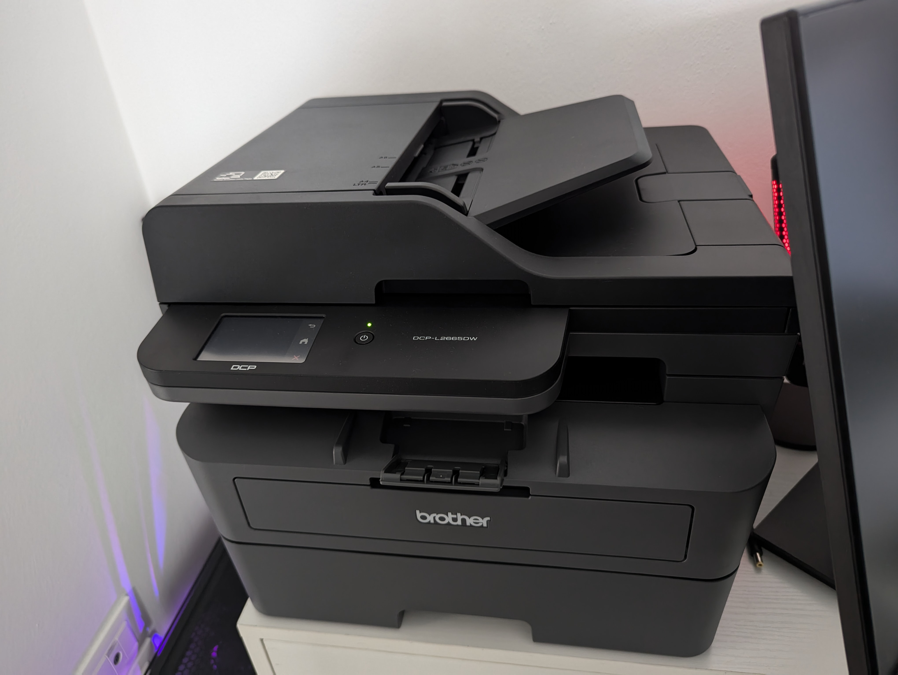

# Brother принтер

В моём случае это DCP-L2665DW

<figure><figcaption></figcaption></figure>

Включаем поддержку принтера

```
epmi cups-browsed avahi-daemon libnss-mdns
```

Включаем сервисы

```
sudo systemctl start --now cups-browsed
```

```
sudo systemctl start --now avahi-daemon
```

```
sudo systemctl enable cups-browsed
```

```
sudo systemctl enable avahi-daemon
```

Включаем поддержку сканера

```
epmi sane sane-airscan libsane-gphoto2
```

Устанавливаем утилиту для сканирования по вкусу

01\. Simple Scan

```
epmi simple-scan
```

02\. Skanlite

```
epmi kde5-skanlite kde5-skanpage
```

Другое

```
    # - tesseract-langpack-en # Поддержка английского языка для tesseract
    # - tesseract-langpack-ru # Поддержка русского языка для tesseract
    # - gimagereader-qt5 # Программа для распознавания текста на изображениях
    # - hplip-sane # Драйвера для HP
    # - imagescan-sane # Поддержка сканеров Epson
    # - iscan-free # Драйвера для сканеров Epson
    # - iscan-data # Данные для сканеров Epson
    # - firmware-iscan # Прошивки для сканеров Epson
    # - epsonscan2 # Программа для сканирования Epson
```
