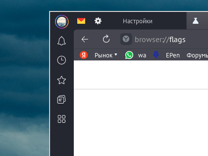
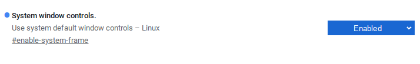
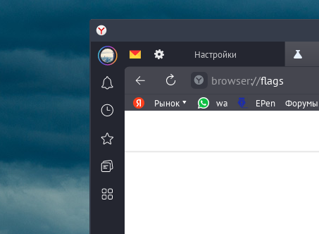

# Yandex Browser

<figure><figcaption></figcaption></figure>


У дистрибутива ALT Linux официальная поддержка от Yandex.


## Платформа P11 и Сизиф&#x20;

```bash
sudo apt-get install yandex-browser-stable
```

## Flatpak (не рекомендуется)

```bash
flatpak install flathub ru.yandex.Browser
```


## Решение проблем и баги


* Отключение белой рамки вокруг браузера

<figure><figcaption></figcaption></figure>

В адресной строке пишем:

```
browser://flags/
```

В этих скрытых настройках надо найти параметр System window controls.

<figure><figcaption></figcaption></figure>

Меняем в нем переключатель на Enabled и перезагружаем браузер

Готово, рамка теперь не белая

<figure><figcaption></figcaption></figure>

* Активируем скрукгление окна в GNOME

<figure><figcaption></figcaption></figure>

Устанавливаем расширение Rounded Window Corners Reborn

<figure><figcaption></figcaption></figure>

### Установить можно через [Менеджер расширений](../../extensions/manager.md), либо через [сайт расширений](https://extensions.gnome.org/extension/7048/rounded-window-corners-reborn/).
