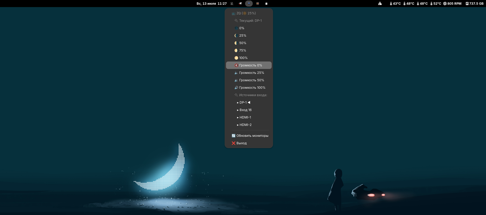

# Monic Monitor Control

Приложение для управления внешними мониторами через системный трей с поддержкой плавной анимации и автоматического обновления.

<figure><figcaption></figcaption></figure>

<details>

<summary>Основные функции</summary>

* 🔆 Управление яркостью с плавной анимацией
* 🔊 Контроль громкости встроенных динамиков
* 🔌 Переключение источников входа
* 📺 Поддержка множественных мониторов
* 🎨 Современный интерфейс в системном трее

- 🔆 **Управление яркостью** с плавной анимацией (0-100%)
- 🔊 **Управление громкостью** встроенных динамиков монитора
- 🔌 **Переключение источников входа** (HDMI, DisplayPort, USB-C)
- 🎬 **Плавная анимация** изменения яркости
- 🔄 **Автоматическое обновление** информации о мониторах
- 📺 **Поддержка множественных мониторов**
- 🎨 **Современный интерфейс** в системном трее
- 🚀 **Быстрые кнопки** для часто используемых настроек

</details>

На Альт Линуксе

```
git clone https://github.com/toxblh/Monic.git
```

```
cd Monic
```

```
./install.sh
```

<pre><code><strong>epmi pip
</strong></code></pre>

```
sudo mkdir -p /etc/modules-load.d; echo i2c-dev | sudo tee /etc/modules-load.d/i2c-dev.conf
```

```
sudo groupadd i2c
```

```
sudo chown :i2c /dev/i2c-*
```

```
sudo usermod -aG i2c $USER
```

```
echo 'KERNEL=="i2c-[0-9]*", GROUP="i2c"' | sudo tee -a /etc/udev/rules.d/10-i2c.rules
```

```
sudo udevadm control --reload-rules
```

```
sudo udevadm trigger
```

#### Первый запуск с консоли (долгий), далее можно из меню приложений

```
~/.local/share/monitor-control/run_monitor_control.sh
```

Чтобы изменения вступили в силу перезапускаем ПК
