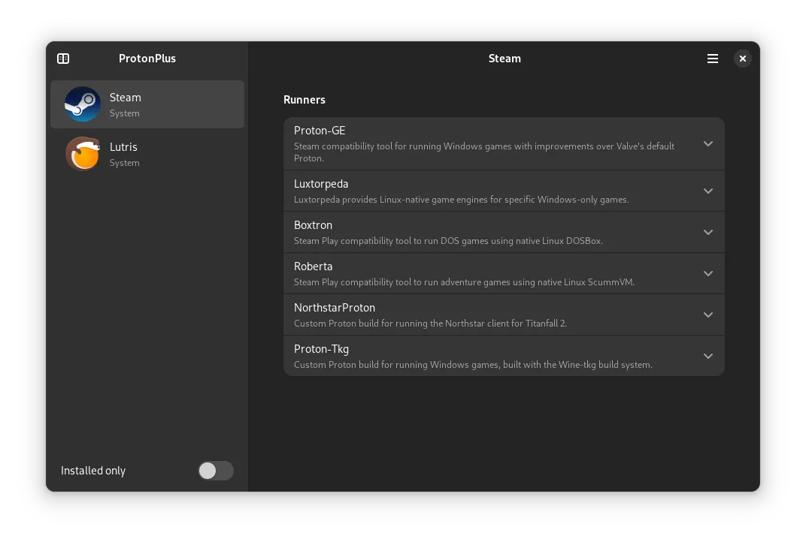

# Proton Plus

<figure><figcaption></figcaption></figure>

Установить ProtonPlus в ALT Linux

```bash
sudo apt-get install protonplus
```

через EPM

```bash
epmi protonplus
```

Flatpak

```bash
flatpak install flathub com.vysp3r.ProtonPlus
```

### Простой менеджер для скачивания альтернативных версий Wine и Proton

Поддерживаемые лаунчеры:

* [Steam](../linuxgaming/steam/)
* [Lutris](../linuxgaming/launcher/lutris.md)
* [Heroic Game Launcher](../linuxgaming/launcher/heroic-games-launcher.md)
* [Bottles](../linuxgaming/launcher/bottles.md)

Поддерживаемые инструменты совместимости:

* Proton-GE
* Luxtorpeda
* Boxtron
* Роберта
* NorthstarProton
* Proton-GE RTSP
* Proton Tkg
* Wine-GE
* Wine-Lutris
* Lutris-GE
* Kron4ek Wine-сборка Vanilla
* Kron4ek Wine-сборка Промежуточная
* Kron4ek Wine-Сборка Промежуточная-Tkg
* DXVK
* DXVK Async (sporif)
* DXVK Async (gnusenpai)
* DXVK GPL + Async (Ph42oN)
* VKD3D-Lutris
* VKD3D-Proton
