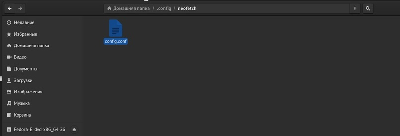
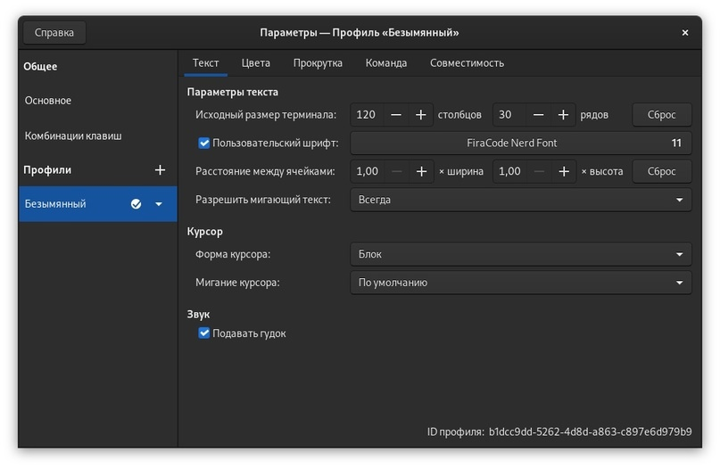
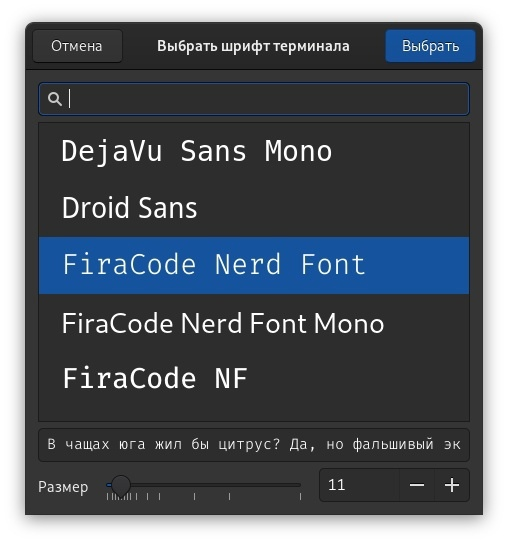

# Neofetch

<figure><figcaption></figcaption></figure>

### Настраиваем Neofetch

```bash
sudo apt-get install neofetch
```



Скачиваем архив и распаковываем всё с заменой в `Домашний каталог`

<figure><figcaption></figcaption></figure>

### Выбираем шрифт в настройках терминала

<div><figure><figcaption></figcaption></figure> <figure><figcaption></figcaption></figure></div>

### Настраиваем цвета на своё усмотрени

### Перезапускаем ПК и смотрим результат
