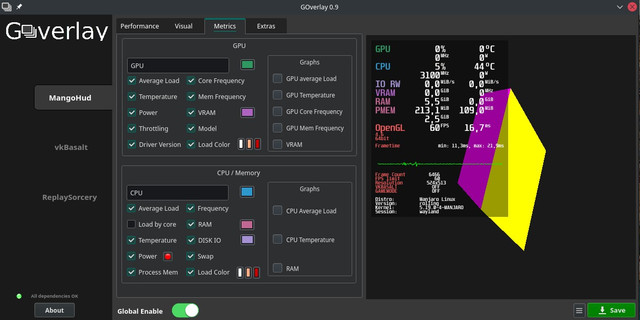
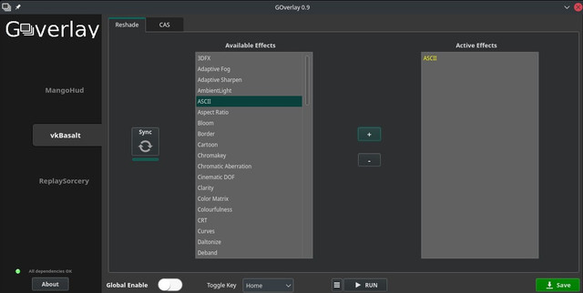
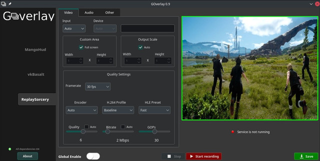

# GOverlay

<div><figure><figcaption></figcaption></figure> <figure><figcaption></figcaption></figure> <figure><figcaption></figcaption></figure></div>

Установка:

```
sudo apt-get install goverlay
```

или через EPM

```
epmi goverlay
```
