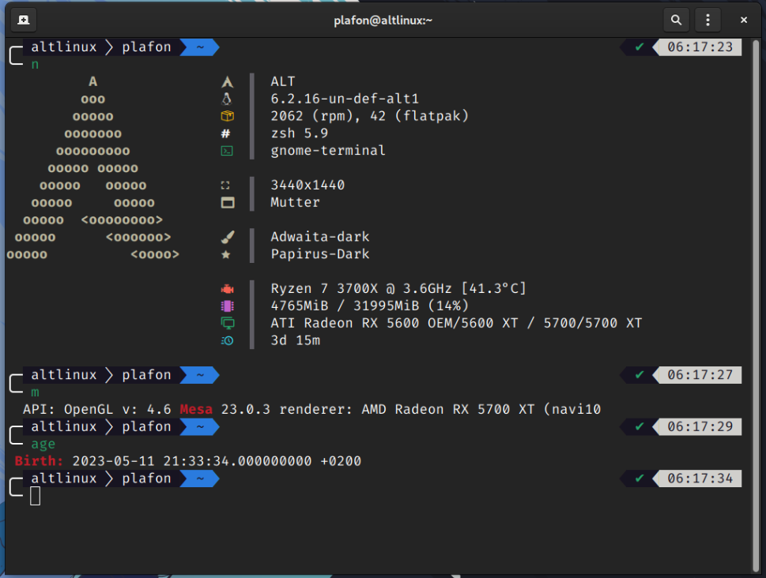

# Терминал. Начало ...

<figure><figcaption></figcaption></figure>


Буквально все, кто хоть краем уха слышал про GNU/Linux, слышали о существовании "гиковского" и "непреклонного" терминала. На самом деле, это очень мощный инструмент и как вы убедитесь далее углубляясь в изучение данного гайда, что зачастую проще вбить одну команду, чем искать различные настройки по интерфейсу.


### Детальная настройка Терминала:




Не робейте! Уже через пару дней, терминал станет для вас отличным помощником в управлении вашей системой.

