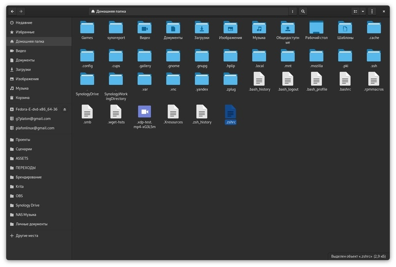

# Терминал на ZSH


Большая благодарность автору канала [`Toxblh. Не только Linux`](https://t.me/toxblh_linux) за предоставленный гайд и сорсы.




Качаем мой `.zshrc`:&#x20;



Закидываем `.zshrc` в папку `/home`

<figure><figcaption><p>Чтобы видеть скрытые файлы и каталоги используем CTRL+H</p></figcaption></figure>

Устанавливаем git и zsh

```bash
sudo apt-get install git zsh
```

Устанавливаем zplug

```bash
git clone https://github.com/zplug/zplug ~/.zplug
```

Выполняем установку всех плагинов zplug, просто вбиваем:

```
zsh
```

<figure><figcaption></figcaption></figure>

Делаем ZSH по умолчанию для нашего терминала:

```
sudo gedit /etc/passwd
```

и меняем `/bin/bash` на `/bin/zsh`:

<figure><figcaption></figcaption></figure>


Обязательно делаем `systemctl logout` или перезапускаем ПК.

