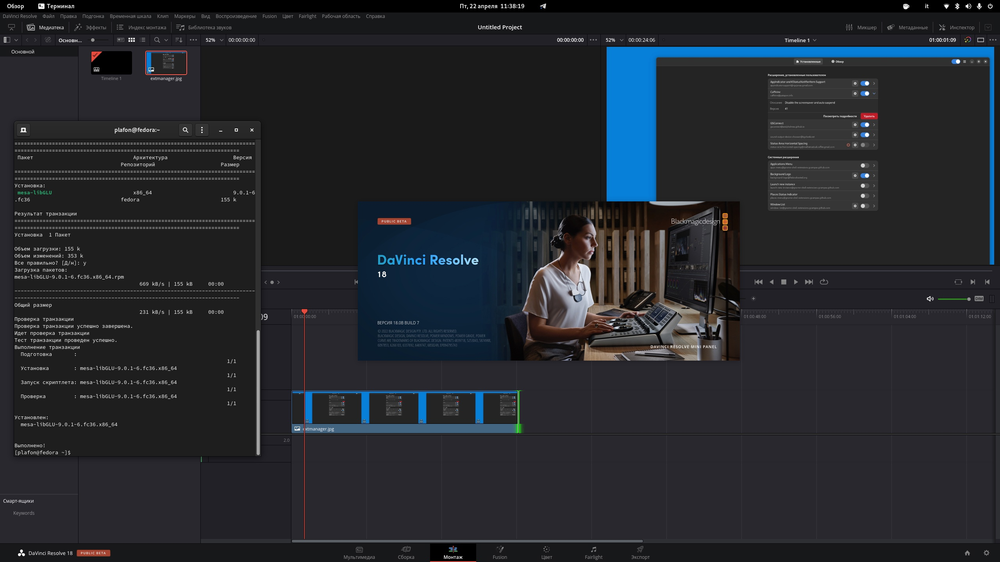

# DaVinci Resolve

<figure><figcaption></figcaption></figure>

## Качаем и устанавливаем сам DaVinci Resolve

<figure><figcaption></figcaption></figure>



Распаковываем скачанный архив

```bash
cd ~/Downloads
```

```bash
unzip DaVinci_Resolve_18.0.4_Linux.zip
```

Устанавливаем DaVinci Resolve 18

```bash
./DaVinci_Resolve_18.0.4_Linux.run -i
```


Для ребят с видеокартами от NVIDIA на этом всё. Приятного творчества!


## ДЛЯ ВИДЕОКАРТ AMD RADEON

### Доустанавливаем этот пакет:

```bash
sudo apt-get isntall libGLU
```

```bash
sudo apt-get install ffmpeg
```

```bash
sudo apt-get install rocm-opencl-runtime 
```

```bash
sudo apt-get install hip-runtime-amd
```


Теперь всё и для лагеря "красных"! Приятного творчества и нам :tada::clap:


<figure><figcaption><p>Видеокарта AMD Radeon отображается корректно в Fedora Linux</p></figcaption></figure>

Проверяем всё ли работает утилитой `clinfo`

```
epmi clinfo
```

```bash
clinfo
```

```bash
Number of platforms                               1
  Platform Name                                   AMD Accelerated Parallel Processing
  Platform Vendor                                 Advanced Micro Devices, Inc.
  Platform Version                                OpenCL 2.1 AMD-APP (3452.0)
  Platform Profile                                FULL_PROFILE
  Platform Extensions                             cl_khr_icd cl_amd_event_callback 
  Platform Extensions function suffix             AMD
  Platform Host timer resolution                  1ns

  Platform Name                                   AMD Accelerated Parallel Processing
Number of devices                                 1
  Device Name                                     gfx1010:xnack-
  Device Vendor                                   Advanced Micro Devices, Inc.
  Device Vendor ID                                0x1002
  Device Version                                  OpenCL 2.0 
  Driver Version                                  3452.0 (HSA1.1,LC)
  Device OpenCL C Version                         OpenCL C 2.0 
  Device Type                                     GPU
  Device Board Name (AMD)                         AMD Radeon RX 5700 XT
  Device PCI-e ID (AMD)                           0x731f
  Device Topology (AMD)                           PCI-E, 0000:0c:00.0
  Device Profile                                  FULL_PROFILE

................
```


## Баги и ошибки


Как посмотреть почему не запускается DaVinci Resolve на Linux ?

Достаточно в терминале выполнить: `/opt/resolve/bin/resolve`



### Ошибка: `/lib64/libgdk_pixbuf-2.0.so.0`

```bash
/opt/resolve/bin/resolve: symbol lookup error: /lib64/libgdk_pixbuf-2.0.so.0: undefined symbol: g_task_set_static_name
```

<figure><figcaption></figcaption></figure>

### Решение:

```bash
sudo rm -rf /opt/resolve/libs/libglib-2.0.so* && sudo rm -rf /opt/resolve/libs/libgio-2.0.so* && sudo rm -rf /opt/resolve/libs/libgmodule-2.0.so*
```

### Ошибка: libpango undefined symbol: g\_string\_free\_and\_steal <a href="#post-title-t3_12z32r1" id="post-title-t3_12z32r1"></a>


Код ошибки:&#x20;

```
./resolve: symbol lookup error: /lib64/libpango-1.0.so.0: undefined symbol: g_string_free_and_steal
```


### Удалить все по запросу `glib` в папке /opt/resolve/libs

<figure><figcaption></figcaption></figure>


## <mark style="color:red;">Архив ошибок</mark>

### РЕШЕНО: DaVinci не запускается на версии ядра 6.6.\*

<figure><figcaption></figcaption></figure>

Решение:

Перейти на версию ядра LTS, я перешёл на un-std

<figure><figcaption></figcaption></figure>
