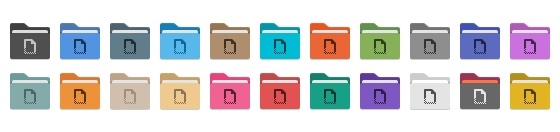
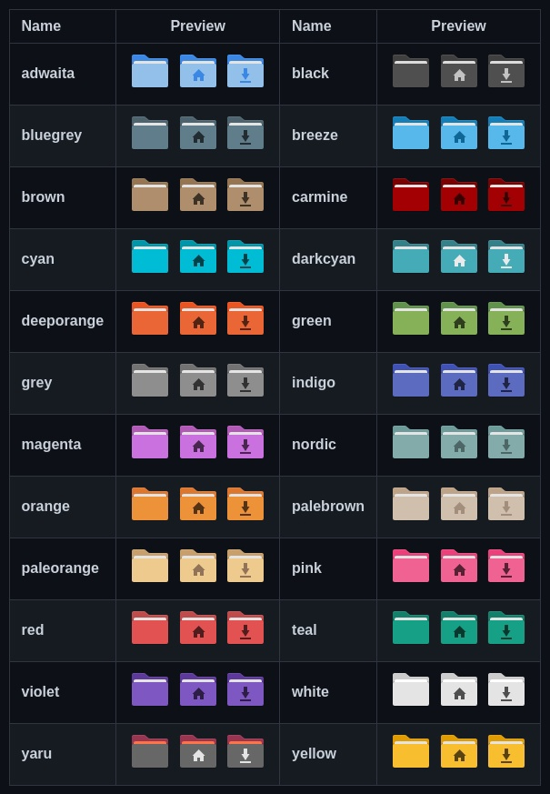

# Цветные папки

<figure><figcaption></figcaption></figure>

### Меняем стиль иконок, выбрав нужное **название** из таблицы:

<figure><figcaption></figcaption></figure>

```
papirus-folders -C adwaita --theme Papirus-Dark
```

### Узнать какой стиль применен сейчас в системе:

```
papirus-folders -l --theme Papirus-Dark
```

### Список доступых стилей для папок:

```
papirus-folders -l
```

<figure><figcaption></figcaption></figure>

### Вернуть дефолтные папки:

```
papirus-folders -D --theme Papirus-Dark
```
