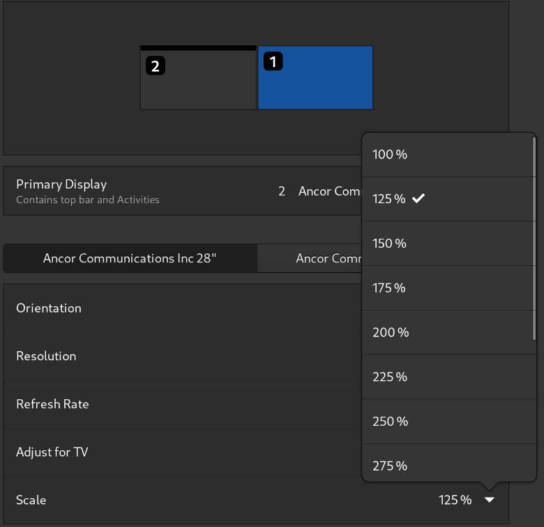

# Включаем дробное масштабирование

<figure><figcaption></figcaption></figure>

Открываем утилиту `DConf`

В поиске ищем `/org/gnome/mutter/experimental-features`

<figure><figcaption></figcaption></figure>

Снимите флажок «Использовать значение по умолчанию».


Перезапускаем сессию GNOМЕ или ПК.



Включение дробного масштабирования, может привести к "мыльной" картинке, поэтому лично я увeличиваю "коэффициент масштабирования" самого текста в [Gnome Tweaks](https://plafon.gitbook.io/fedora-zero/fedora-zero/v-samom-nachale-.../dop.-nastroiki-gnome).


<figure><figcaption></figcaption></figure>
