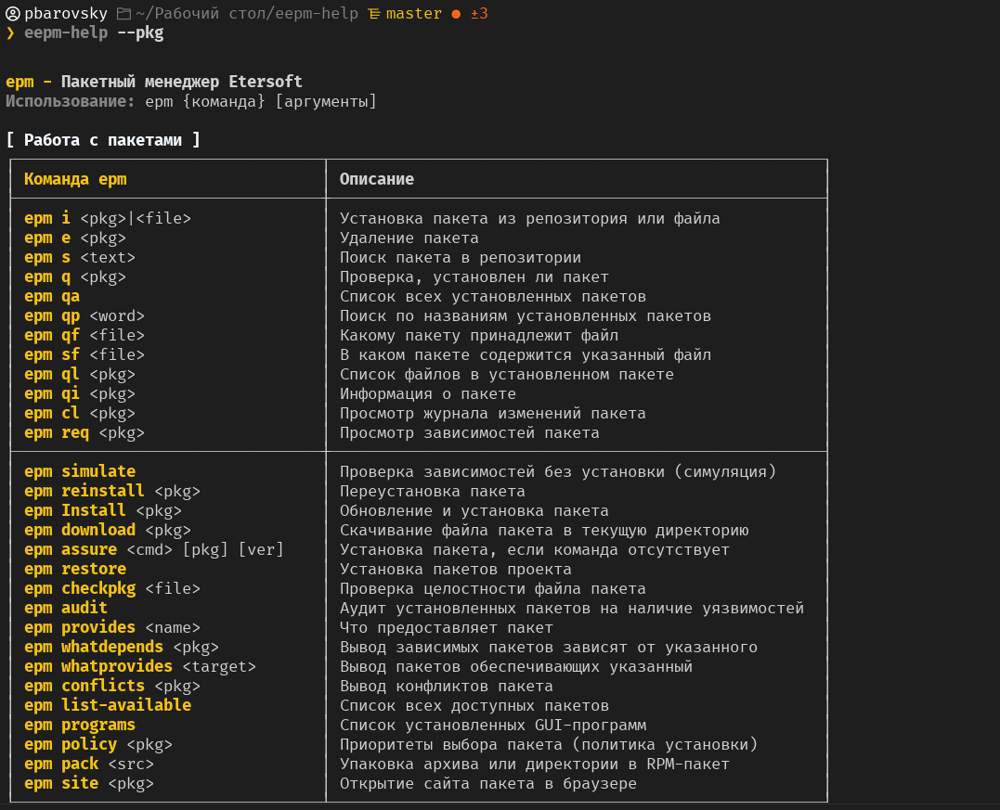
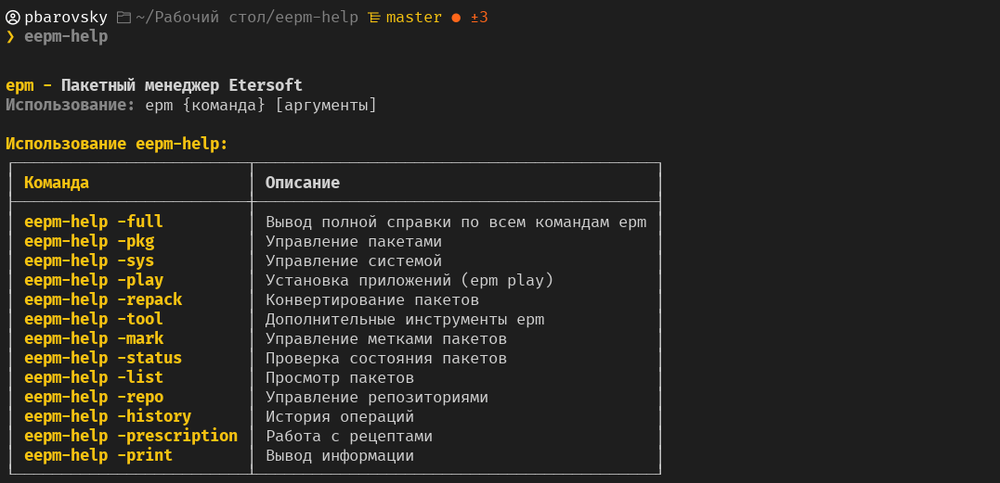

# EPM (eepm-help)

<details>

<summary>Что такое EPM?</summary>

EPM - единая команда управления пакетами, разработанная в компании Etersoft[\[1\]](https://www.altlinux.org/Epm#cite_note-1). Основное предназначение: унифицировать управление пакетами в дистрибутивах с разными пакетными менеджерами. Кроме того, сейчас в epm заскриптованы некоторые типовые операции, которые, например, в случае использования apt в ALT, потребовали бы ввода более одной команды.

Посредством epm можно попытаться установить в систему чужой пакет (предназначенный для другой ОС на базе Linux). Пакет, при этом, конвертируется в пригодный формат, но:

**Внимание!**

1. При установке чужих пакетов (не из репозитория дистрибутива) не предоставляется никаких гарантий.
2. Для перепаковки чужих пакетов есть некие общие моменты, которые epm может сделать автоматически. Если это получилось, Вам повезло.
3. [](https://github.com/pbarovsky/eepm-help/blob/master/screenshots/2.png)
4. Если не повезло, то персонально под какие-то чужие пакеты можно написать вспомогательные скрипты. Их надо класть в /etc/eepm/, там уже есть некоторые скрипты, кем-то (в основном автором epm) написанные ранее и добавленные в пакет eepm. Скрипт может устареть: мало ли, как разработчик соберёт пакет с очередной версией.

</details>

### Установка EPM на ALT Linux

<pre class="language-bash"><code class="lang-bash"><strong>sudo apt-get update
</strong></code></pre>

<pre class="language-bash"><code class="lang-bash"><strong>sudo apt-get install eepm
</strong></code></pre>

## EEPM-HELP: справка по командам EPM&#x20;



<div><figure><figcaption></figcaption></figure> <figure><figcaption></figcaption></figure></div>

`epm` — имеющая одинаковый интерфейс на всех системах команда управления пакетами. При интерфейсе, похожем на rpm, apt и urpm, выполняет необходимые операции на любой платформе.

### Установка eepm-helper в ALT Linux

1. Склонируйте репозиторий:

```
git clone https://github.com/pbarovsky/eepm-help.git
```

2. Перейдите в директорию

```
cd eepm-help
```

3. Скопируйте скрипт в `/usr/bin`

```
sudo cp eepm-help.sh /usr/bin/eepm-help
```

4. Сделайте скрипт исполняемым:

```
sudo chmod +x /usr/bin/eepm-help
```

5. Перезапустите терминал или выполните

```
# если используешь zsh
source ~/.zshrc

# если используешь bash
source ~/.bashrc
```

6. Проверьте работу скрипта

```
eepm-help
```

***

Скрипт работает в среде Linux с bash и zsh.

## Список основных команд EPM


Команда `epm` используется без `sudo`. Когда `sudo` необходим `EPM` будет сам его задействовать.


| Описание операции                              | Команда EPM         | Команда ALT Linux              |
| ---------------------------------------------- | ------------------- | ------------------------------ |
| Установка пакета по названию в систему         | epmi (package)      | apt-get install (package)      |
| Установка файла пакета в систему               | epmi (package file) | apt-get install (package file) |
| Удаление пакета из системы                     | epme (package)      | apt-get remove (package)       |
| Поиск пакета в репозитории                     | epms (text)         | apt-cache search (text)        |
| Проверка наличия пакета в системе              | epmq (package)      | rpm -qa (pipe) grep (package)  |
| Список установленных пакетов                   | epmqa               | rpm -qa                        |
| Поиск по названиям установленных пакетов       | epmqp (word)        | grep (word)                    |
| Принадлежность файла к (установленному) пакету | epmqf (file)        | rpm -qf (file)                 |
| Список файлов в (установленном) пакете         | epmql (package)     | rpm -ql (package)              |
| Вывести информацию о пакете                    | epmqi (package)     | apt-cache show (package)       |
| Обновить дистрибутив                           | epm upgrade         | apt-get dist-upgrade           |




