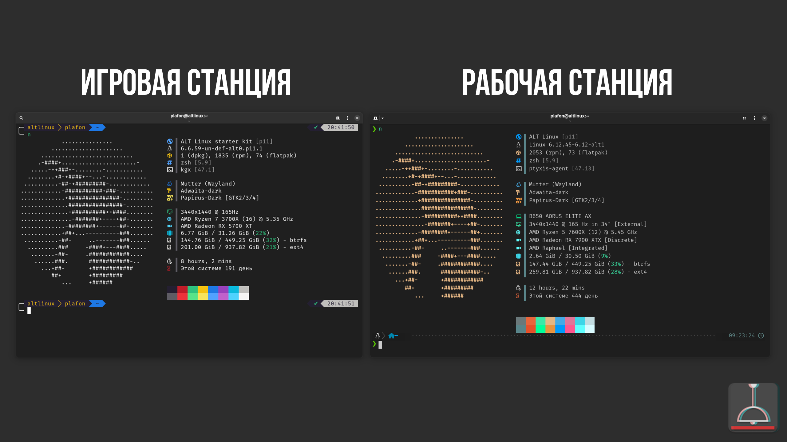

# Мой компьютер

<figure><figcaption></figcaption></figure>

## Рабочая станция (изначально игровая):

**MoBo:** B650 AOURUS ELITE AX\
**CPU:** AMD Ryzen 5 7600X 6 ядер 12 потоков 5.45 Ghz\
**GPU:** AMD Radeon RX 7900 XTX\
**RAM:** Corsair Vengeance RGB DDR5 32GB 6200Mhz\
**SSD #1:** Patriot P300 M.2 2280 250GB \[Система]\
**SSD #2:** Kingston NV2 4TB M.2 2280

## Игровая станция (изначально рабочая)


Игровая станция это стационарный ПК подключённый к 55'' телевизору LG OLED55B26LA. Играю сугубо с геймпада на диване с расстояния 2-х метров, поэтому для себя понял, что 4К избыточен и мне хватает 1440p или даже 1080 с FSR. Зачастую использую Steam Deck LCD для Remote Play с данного ПК, качество само собой потрясающее.


**MoBo:** ASUS TUF GAMING B550-PLUS\
**CPU:** AMD Ryzen 7 3700X 8 ядер 16 потоков 4,4Ghz\
**GPU:** AMD Radeon RX 5700 XT\
**RAM:** Crucial Ballistix DDR4 32gb 3600mhz\
**SSD:** ADATA NVME SX8200PNP 1TB

## Переферия

Клавиатура: Logitech MX Keys\
Мышь: Logitech MX Master 3 Black\
Колонки: Logitech Z270\
Коврик: Logitech Desk Mat\
\
Доп. клавиатура: Logiteck K400 c трекпадом (для игровой станции)

