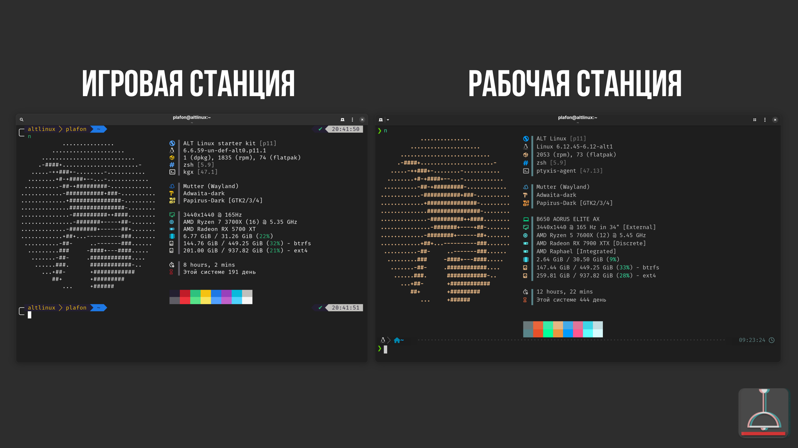

# Мой компьютер

<figure><figcaption></figcaption></figure>

## Рабочая станция (изначально игровая):

Система (Сентябрь 2025)

ОС: ALT P11 StarterKit\
Ядро: Linux 6.12.45-6.12-alt1\
Пакетов в системе: 2053 (rpm), 73 (flatpak)\
Shell: zsh\
Терминал: ptyxis\
Driver: AMDGPU Mesa 25.1.9\
Display Server: Wayland\
Разрешение экрана: 3440x1440\
Рабочее окружение: GNOME 47.4\
Оконный менеджер: Mutter\
Тема: Adwaita Dark\
Icons: Papirus Dark

**MoBo:** B650 AOURUS ELITE AX\
**CPU:** AMD Ryzen 5 7600X 6 ядер 12 потоков 5.45 Ghz\
**GPU:** AMD Radeon RX 7900 XTX\
**RAM:** Corsair Vengeance RGB DDR5 32GB 6200Mhz\
**SSD #1:** Patriot P300 M.2 2280 250GB \[Система]\
**SSD #2:** Kingston NV2 4TB M.2 2280

## Игровая станция (изначально рабочая)


Игровая станция это стационарный ПК подключённый к 55'' телевизору LG OLED55B26LA. Играю сугубо с геймпада на диване с расстояния 2-х метров, поэтому для себя понял, что 4К избыточен и мне хватает 1440p или даже 1080 с FSR. Зачастую использую Steam Deck LCD для Remote Play с данного ПК, качество само собой потрясающее.


Система: SteamOS 3.8 \[[Образ для Steam Deck](https://help.steampowered.com/ru/faqs/view/65B4-2AA3-5F37-4227)]


Да, я использовал непосредственно образ для восстановления Steam Deck, записал его в Gnome Disk (можно в Balena Etcher) на флешку и установил как самый обычный дистрибутив. Образ записывался довольно долго.


**MoBo:** ASUS TUF GAMING B550-PLUS\
**CPU:** AMD Ryzen 7 3700X 8 ядер 16 потоков 4,4Ghz\
**GPU:** AMD Radeon RX 5700 XT\
**RAM:** Crucial Ballistix DDR4 32gb 3600mhz\
**SSD:** ADATA NVME SX8200PNP 1TB


Игры работают замечательно, но есть ряд косяков:\
\
\- Не работает выход из сна, приходится делать ребут\
\- Периодически отваливается второй SSD с игровой библиотекой Steam, приходится переходить в режим Рабочего стола и подключать руками в Dolphin.\
\- Не работает HDMI-CEC (ожидаемо)\
\
В остальном, очень положительный игровой опыт в сравнении с обычным дистрибутивом + Steam BigPicture: нет проблем с разрешением в играх, всё хорошо масштабируется, HDR из коробки, MongoHUD и боковое меня как в Steam Deck. Обновляется тоже аналогично Steam Deck.


## Периферия

Клавиатура: Logitech MX Keys\
Мышь: Logitech MX Master 3 Black\
Колонки: Logitech Z270\
Коврик: Logitech Desk Mat\
\
Доп. клавиатура: Logiteck K400 c трекпадом (для игровой станции)

