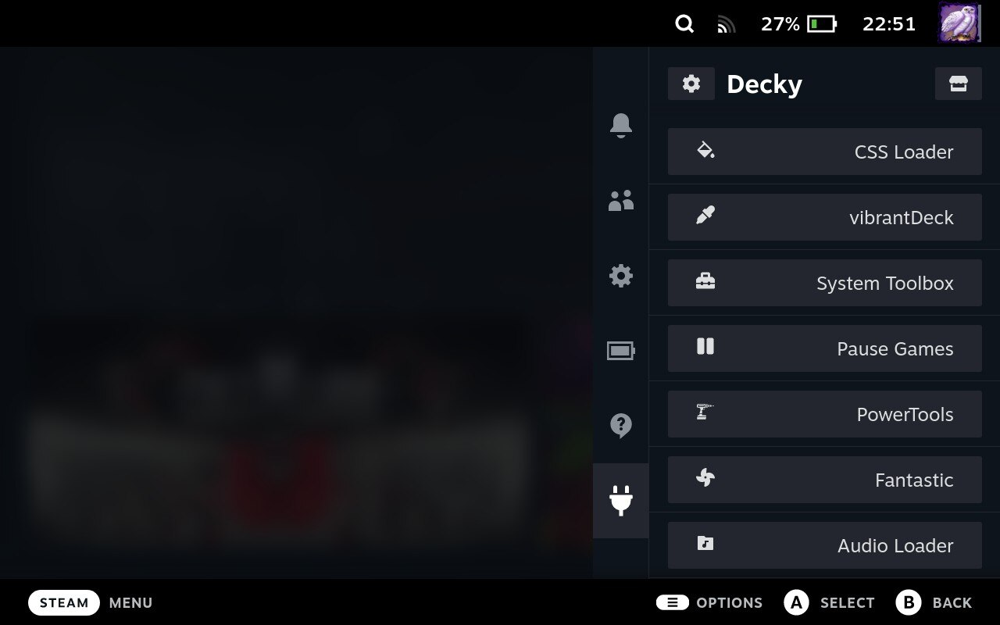

# Decky Loader

<figure><figcaption></figcaption></figure>

### Установить Decky Loader на Steam Deck

01\. Переходим в режим рабочего стола

02\. Открываем Konsole и вставляем данную команду:

```bash
curl -L https://github.com/SteamDeckHomebrew/decky-installer/releases/latest/download/install_release.sh | sh
```

03\. Вводим пароль суперпользователя (root)

04\. Возваращаемся в игровой режим


### Удаляем Decky Loader со Steam Deck

01\. Переходим в режим рабочего стола

02\. Открываем Konsole и вставляем данную команду:

```bash
curl -L https://github.com/SteamDeckHomebrew/decky-installer/releases/latest/download/uninstall.sh | sh
```

03\. Вводим пароль суперпользователя (root)

04\. Возваращаемся в игровой режим
