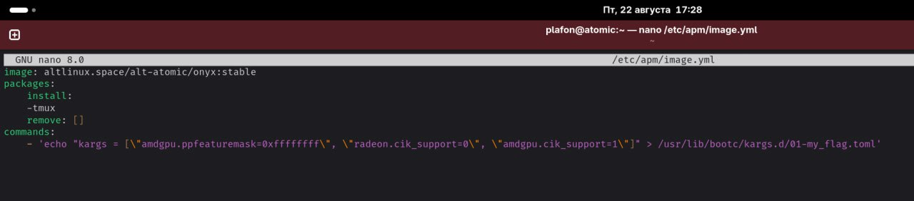
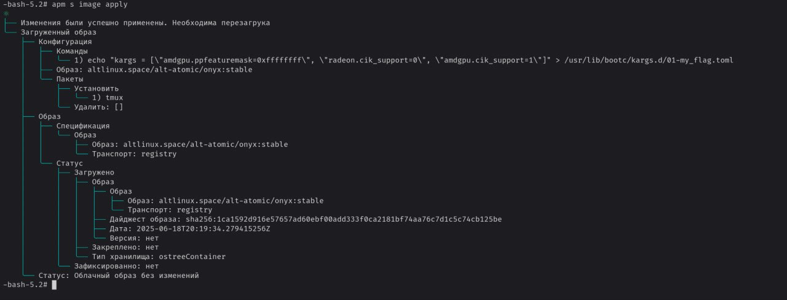
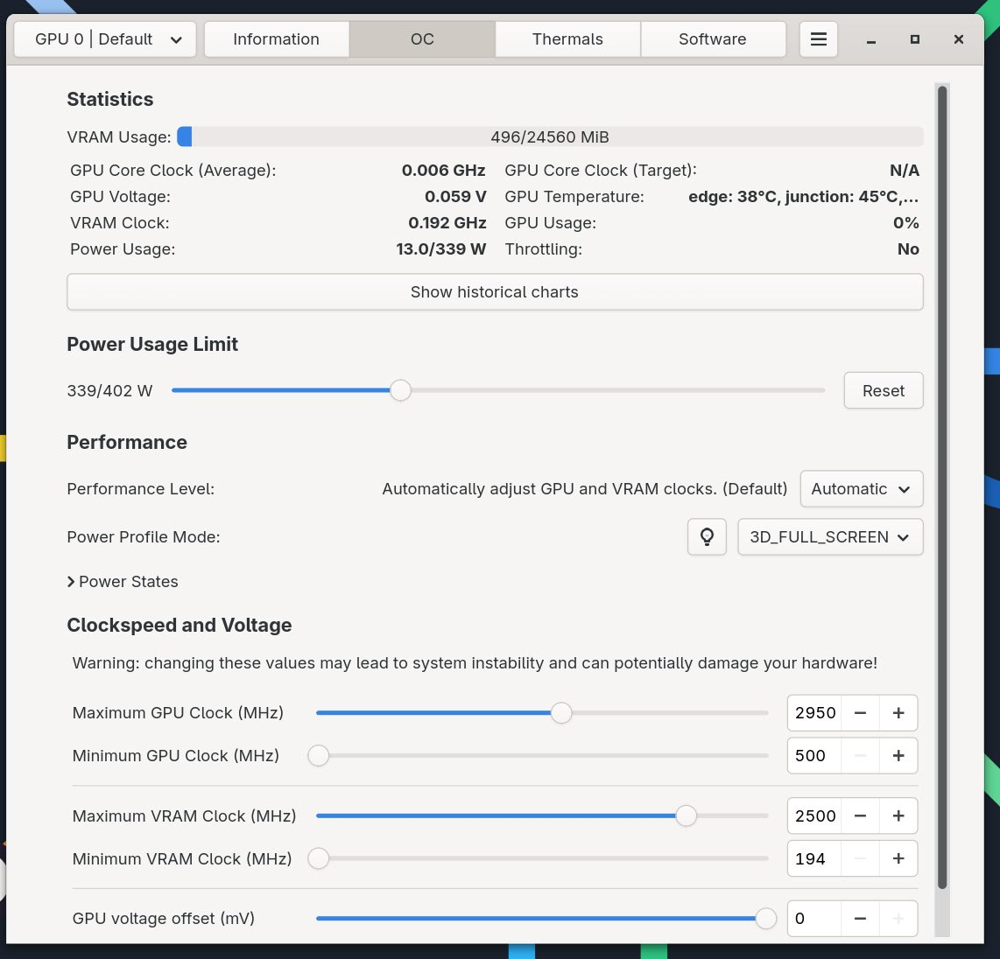

# Разгон видеокарты AMD

<figure><figcaption><p>CoreCTRL</p></figcaption></figure>

Необходимо добавить эти параметры в опции загрузки ядра:

```
amdgpu.ppfeaturemask=0xffffffff radeon.cik_support=0 amdgpu.cik_support=1
```

Для GRUB

```bash
sudo nano /etc/sysconfig/grub2
```

Должно получится примерно так (_**кавычки важны!**_):


Пример:&#x20;

```
GRUB_CMDLINE_LINUX_DEFAULT='quiet splash ваш_пункт1 ваш_пункт2'
```


<figure><figcaption></figcaption></figure>

И пересобираем GRUB чтобы закрепить новые параметры, командой:

```bash
sudo update-grub
```


Перезапускаем ПК, опции разгона должны активироваться!


<figure><figcaption></figcaption></figure>




## Для ALT Atom&#x20;

В атомарной версии дистрибутива для запуска системы используется bootc

Редактируем конфигурацию образа

```bash
sudo nano /etc/apm/image.yml
```

В секцию commands: необходимо добавить наши параметры в виде массива:

```toml
commands:
    - 'echo "kargs = [\"amdgpu.ppfeaturemask=0xffffffff\", \"radeon.cik_support=0\", \"amdgpu.cik_support=1\"]" > /usr/lib/bootc/kargs.d/01-my_flag.toml'
```

Должно получиться вот так:


Существует баг, пока не пофиксили, но секция install не должна быть пустой. Я поставил например tmux, можно выбрать любой пакет без разницы.


<figure><figcaption></figcaption></figure>

После этого пересобираем образ с применением настроек:

```
apm s image apply
```

<figure><figcaption></figcaption></figure>

Перезагружаем систему и теперь всё работает

<figure><figcaption></figcaption></figure>
